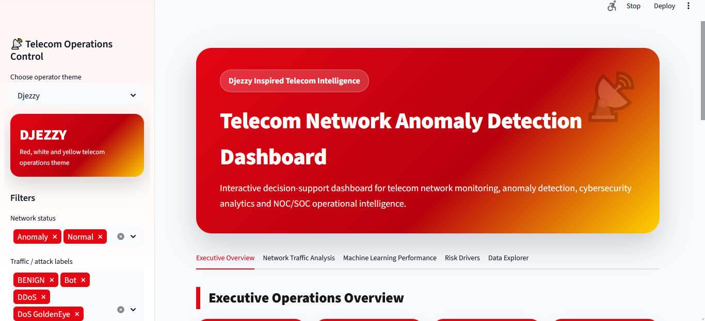

# Telecom Network Anomaly Detection Dashboard

## Live Demo

The interactive Streamlit dashboard is available here:

[Open the Telecom Network Anomaly Detection Dashboard](https://telecom-anomaly-intelligence.streamlit.app/)

---

## Project Overview

This project is a telecom network anomaly detection and cybersecurity analytics dashboard inspired by the operational needs of telecom operators such as **Djezzy, Mobilis and Ooredoo**.

The objective is to detect suspicious network flows and classify telecom traffic as:

- **Normal**
- **Anomaly**

The project combines:

- data preprocessing;
- exploratory data analysis;
- feature engineering;
- supervised machine learning;
- model validation;
- Streamlit dashboard development;
- telecom-themed visual design.

The final dashboard is designed as a decision-support tool for **NOC/SOC teams** to monitor network anomalies, understand attack patterns and support cybersecurity operations.

---

## Application Preview

### Executive Overview



### Network Traffic Analysis


### Machine Learning Performance


### Risk Drivers


---

## Dataset

The project is based on the **CICIDS2017** network intrusion detection dataset.

The raw dataset contains network-flow records representing both normal traffic and different types of cyber-attacks.

Main traffic classes include:

- BENIGN
- DDoS
- DoS Hulk
- DoS GoldenEye
- DoS slowloris
- DoS Slowhttptest
- PortScan
- FTP-Patator
- SSH-Patator
- Bot
- Web Attack - Brute Force
- Web Attack - XSS
- Web Attack - SQL Injection
- Infiltration
- Heartbleed

Because the original raw files are large, only a processed application sample is included in this repository for dashboard deployment.

---

## Project Workflow

The notebook follows a complete machine learning workflow:

1. Importing required libraries
2. Detecting raw CICIDS2017 files
3. Reading and inspecting traffic labels
4. Exploratory data analysis
5. Cleaning column names and labels
6. Handling missing and infinite values
7. Handling invalid negative values
8. Removing constant features
9. Creating engineered network features
10. Removing duplicate records
11. Building train-test splits
12. Training multiple machine learning models
13. Evaluating overfitting risk
14. Running attack-aware validation
15. Selecting the final model
16. Analyzing feature importance
17. Building the Streamlit dashboard

---

## Feature Engineering

Additional features were created to improve network anomaly detection, including:

- total packet count;
- total byte count;
- forward/backward packet ratio;
- forward/backward byte ratio;
- packet asymmetry;
- byte asymmetry;
- bytes per packet;
- packets per duration;
- total TCP flag count;
- active/idle ratio;
- logarithmic transformations of skewed traffic variables.

These engineered features help the model better capture abnormal communication patterns.

---

## Machine Learning Models

Several models were trained and compared:

| Model | Role |
|---|---|
| Logistic Regression | Baseline interpretable model |
| Random Forest | Robust tree-based model |
| Extra Trees | High-performance ensemble model |
| HistGradientBoosting | Final selected model |

The final selected model is:

**HistGradientBoosting**

---

## Final Model Performance

The final model was evaluated using an attack-stratified test set.

| Metric | Value |
|---|---:|
| Accuracy | 0.9987 |
| Precision | 0.9977 |
| Recall | 0.9996 |
| F1-score | 0.9986 |
| ROC-AUC | 1.0000 |

The model showed very strong performance on known attack categories represented in both training and testing sets.

---

## Validation Strategy

This project uses multiple validation checks:

### 1. Duplicate-Free Validation

Exact duplicate records were removed before model validation to reduce duplicate contamination.

### 2. Overfitting Audit

Train and test performance were compared.  
The performance gap was very small, showing no strong evidence of classical overfitting.

### 3. Attack-Stratified Validation

The final validation strategy ensures that all attack categories are represented in both training and testing sets.

### 4. Source-File Stress Test

A stricter source-file split was also tested.  
This test showed that supervised models may struggle with attack families that are not represented during training.

This limitation is important and realistic: supervised models work best when the training data contains representative examples of the attack types they are expected to detect.

For future work, an unsupervised anomaly detection layer could be added to improve zero-day attack detection.

---

## Dashboard Features

The Streamlit application includes:

- interactive telecom operator theme selector;
- Djezzy, Mobilis and Ooredoo inspired themes;
- executive KPI cards;
- Normal vs Anomaly traffic analysis;
- traffic label distribution;
- EDA visualizations;
- machine learning model comparison;
- overfitting audit visualization;
- confusion matrix;
- ROC and Precision-Recall curves;
- feature importance analysis;
- data explorer;
- CSV download option.

---

## Operator Themes

The dashboard includes three visual themes:

| Operator | Theme |
|---|---|
| Djezzy | Red, white and yellow |
| Mobilis | Green, white and red |
| Ooredoo | Red, white and light gray |

---

## Project Structure

```text
telecom-network-anomaly-detection-dashboard/
│
├── .streamlit/
│   └── config.toml
│
├── data/
│   └── processed/
│       ├── telecom_network_app_sample.csv
│       ├── model_comparison_results.csv
│       ├── cross_validation_results.csv
│       └── threshold_optimisation_results.csv
│
├── figures/
│   ├── 01_global_label_distribution.png
│   ├── 02_feature_comparison_boxplots.png
│   ├── 03_correlation_heatmap.png
│   ├── 04_model_comparison.png
│   ├── 05_overfitting_audit.png
│   ├── 06_confusion_matrix.png
│   ├── 07_roc_pr_curves.png
│   ├── 08_feature_importance_rf.png
│   ├── 09_permutation_importance.png
│   ├── 10_threshold_optimisation.png
│   └── 11_confusion_matrix_optimised_threshold.png
│
├── notebook/
│   └── telecom_network_anomaly_detection.ipynb
│
├── screenshots/
│   ├── app_overview.png
│   ├── network_analysis.png
│   ├── model_performance.png
│   └── risk_drivers.png
│
├── app.py
├── README.md
├── requirements.txt
└── .gitignore
